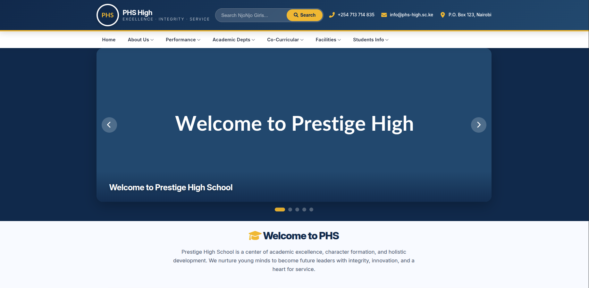

# 🏫 School WEB Responsive Static UI

A modern, fully responsive single-page static website design for a high school, built with HTML5, CSS3, and vanilla JavaScript. This project showcases a clean layout, interactive components, and a mobile-first approach — ideal for a school’s online presence.

## 📖 Overview
This repository contains the front-end code for Prestige High School – a polished, user‑friendly static website. It is designed to serve as a digital brochure, providing key information about the school, its news, events, and culture. The interface is fully responsive, working seamlessly across desktops, tablets, and smartphones.

The design is based on a typical school website template but has been modernised with a contemporary colour palette, subtle animations, and interactive elements to enhance user engagement. All data (news, events, carousel images) are static placeholders, making it easy to adapt to a real back‑end system.

## ✨ Features
- Responsive Layout – Adapts gracefully from large screens to mobile devices using CSS Grid, Flexbox, and media queries.
- Sticky Navigation – Dropdown menus with multi‑column support, collapsing to a hamburger menu on mobile.
- Hero Carousel – Auto‑playing image slider with manual controls and dot indicators, featuring overlay captions.
- News Ticker – Automatically cycles through latest updates with a smooth fading effect.
- Event Calendar – Displays a monthly grid with event chips; clicking an event or a day reveals details in a modal.
- Interactive Modal – Clean pop‑up for event descriptions, triggered by calendar items.
- Social Bar – Prominent links to social media profiles.
- Search Bar – Functional front‑end search field (styling only, no back‑end integration).
- Footer – Contains copyright, contact details, and quick links.

## 🛠️ Technologies Used
- HTML5 – Semantic markup for structure.
- CSS3 – Custom styles with Flexbox, Grid, transitions, and animations.
- Font Awesome 6 – Icons for visual enhancement.
- Google Fonts (Inter) – Modern, readable typeface.
- JavaScript (Vanilla) – Carousel logic, calendar generation, news ticker, modal control, and mobile navigation toggling.
- No external libraries or frameworks – Lightweight and dependency‑free.

## 🚀 Getting Started
### Prerequisites
- A modern web browser (Chrome, Firefox, Edge, Safari).
- (Optional) A local development server (e.g., VS Code Live Server, Python http.server) for the best experience.

### Installation
1. Clone the repository:
   ```bash
   git clone https://github.com/jumagemini/school-web.git
   ```
2. Navigate to the project folder:
   ```bash
   cd school-web
   ```  	
3. Open _index.html_ in your browser.

	For a better development workflow, you can use Live Server:

	- In VS Code, install the Live Server extension.

	- Right‑click on index.html and select Open with Live Server.

	That’s it – no build step or dependencies required!
	
All styles and scripts are embedded within the single HTML file for simplicity and ease of deployment. For production, you may extract them into separate _.css_ and _.js_ files.
## 🧩 Customisation

### Changing Static Content

- **School name, contact details, and footer text** – Update directly in the HTML inside the `<header>`, `<footer>`, and the welcome section.
- **News items** – Modify the `newsData` array in the JavaScript (look for `const newsData = [...]`).
- **Calendar events** – Modify the `sampleEvents` array (format: `{ date: 'YYYY-MM-DD', title: '...', desc: '...' }`).
- **Carousel slides** – Update the `` `src` attributes and captions inside `#carouselSlides`. Adjust the number of slides and the dots will update automatically.

### Styling

All CSS is located within `<style>` tags in the `<head>`. You can easily change:

- **Primary colours** – Search for `#0b2b4a` (dark blue) and `#f5b342` (gold) to replace with your brand colours.
- **Font** – Replace the Google Font link and the `font-family` property.
- **Spacing & layout** – Modify the `.container` `max‑width`, `padding`, and grid gaps as needed.

### Adding Interactivity

The JavaScript is placed at the bottom of the `<body>`. It handles:

- Carousel autoplay and navigation.
- News ticker rotation.
- Calendar generation and event clicks.
- Mobile menu toggling.
- Modal show/hide.

You can extend these functions or replace the static data with API calls to a back‑end.

---

## 📱 Responsiveness

The design is fully responsive and has been tested on:

- **Large screens (≥1200px)** – Full layout with horizontal nav and side‑by‑side news/calendar.
- **Tablets (768–992px)** – Navigation collapses to hamburger; news and calendar stack vertically.
- **Phones (<768px)** – Header stacks, search bar shrinks, calendar cells become compact, and fonts scale down.

All breakpoints are defined with `@media` queries in the CSS.

---

## 🎨 Design Rationale

The UI aims to convey trust, excellence, and warmth – key attributes of a reputable high school. The colour scheme combines a deep navy blue (authoritative and stable) with gold accents (prestige and optimism). Rounded corners, subtle shadows, and smooth transitions give a modern, approachable feel.

The layout prioritises content hierarchy: the hero carousel grabs attention, followed by a welcome message, then the news and calendar – the two most dynamic sections for a school website. The social bar and footer anchor the page with clear calls‑to‑action.

---

## 🤝 Contributing

Contributions are welcome! If you have suggestions for improvements, please fork the repository and submit a pull request. For major changes, please open an issue first to discuss what you would like to change.

---

## 📄 License

This project is open‑source and available under the [MIT License](https://opensource.org/licenses/MIT). You are free to use, modify, and distribute it for personal or commercial purposes, with attribution.

---

## 📧 Contact

For any questions or feedback, please reach out via [jumagemini@gmail.com](mailto:jumagemini@gmail.com) or open an issue on GitHub.

---

Made with ❤️ for the school community.

